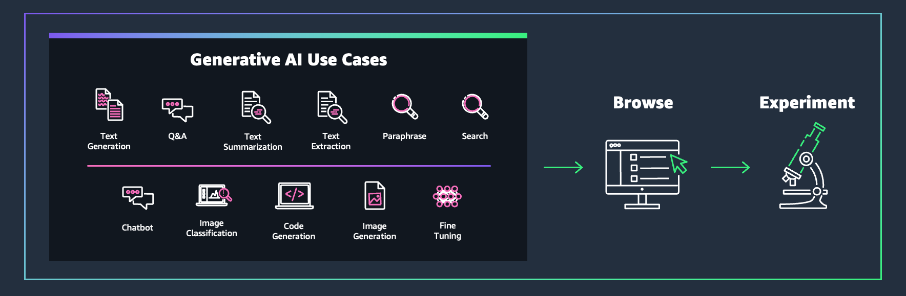

## Generative AI Atlas

[:point_right: **Click here to access the _Generative AI Atlas_** :point_left:](https://gen-ai-atlas.d2fpo0i5kstaiq.amplifyapp.com)

The **Generative AI Atlas** is an organized repository designed for individuals seeking to explore the newest content released by AWS on Generative AI. The Atlas serves as a publicly accessible directory that gathers various resources related to Generative AI, including Blog Posts, Code Samples, Tutorials, Videos, and Workshops, all published on official AWS channels. To facilitate a seamless exploration experience, the Atlas offers a search bar and a comprehensive set of filters, empowering users to quickly find relevant assets for a specific use case of interest. Whether you’re a beginner or an experienced practitioner, the Generative AI Atlas presents a curated selection of content to support your journey.




### Generative AI Atlas source code and raw data
The resources listed in the Generative AI Atlas are available in the `atlas.csv` file stored in the `public` folder. 

In case you want to run the web app locally, clone the repository and follow the steps below:

Install the dependencies:
```
npm install
```

Start the project:
```
npm run start
```
